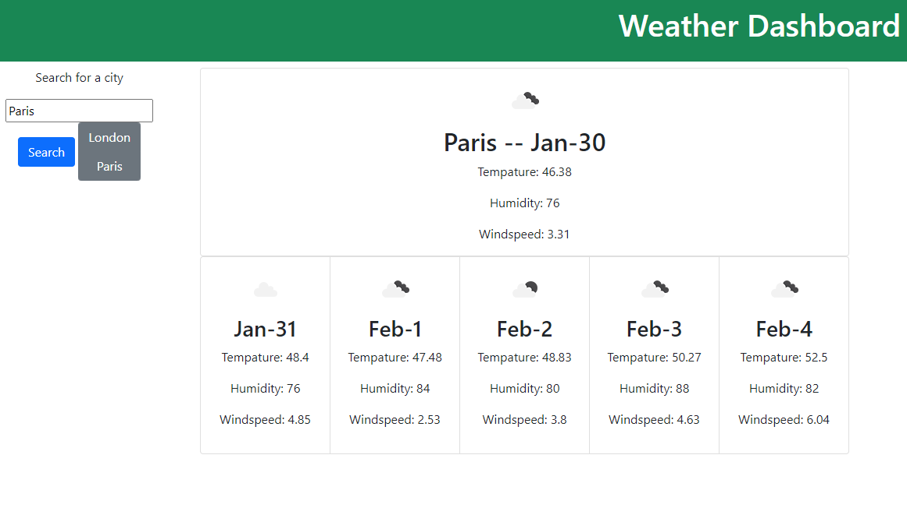

# Weather Dashboard

## Description
This application will display the current weather conditions and the future weather conditions for a given city when searched by a user.

## Installation

N/A

## Usage
When the user loads the [webpage](https://adpileggi.github.io/weather-dashboard/), they will see a search bear where they can enter the name of a city. Upon clicking the search buttion, the webpage will populate with the current and future weather conditions for the next five days. The user will also see the name of the city that was searched appear as a button next the the search bar. When the user clicks on one of these new buttions, they will see the page generate the current and future weather conditons for the city that was named on the button.

## Credits
Collerbrated with Donnahue George

##Liscense
Please refer to the license in the repo.